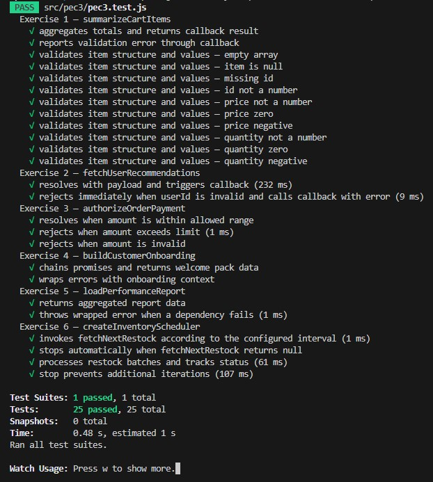

# ⏱️ JS Asynchrony — Callbacks, promises & scheduling in JavaScript

<sub>🗓️ Developed in December 2025</sub>

This project contains a set of **JavaScript programming exercises** designed to practise and evaluate asynchronous programming techniques, including callbacks, promises, and async/await, as well as the different combinations between them.  
With the exercises included, the following competences are developed:
- Autonomous and self-directed learning.
- Problem-solving by identifying, analysing, and defining significant elements.
- Appropriate use of JavaScript and modern development tools.
- Application of the most suitable software architecture patterns for each problem.

---

## ✅ Features

- **Exercise 1 – Cart Summarizer**: Validates a list of cart items and computes totals (quantity, price, sorted IDs) using a **callback** pattern.
- **Exercise 2 – User Recommendations**: Returns a **promise** that resolves after a delay and also notifies via a callback with personalised recommendations.
- **Exercise 3 – Payment Authorization**: Promise-based flow with **resolve/reject logic** based on business rules for order amount validation.
- **Exercise 4 – Customer Onboarding**: Coordinates three dependent async steps via **promise chaining**, propagating and transforming errors.
- **Exercise 5 – Performance Report**: Combines two async data sources using **async/await** and structured `try/catch` error handling.
- **Exercise 6 – Inventory Scheduler**: Background process using **async/await** iterations, periodic task control, and cancellation via a start/stop interface.
- **Test-driven**: All exercises are verified via automated tests using **Jest**.

---

## 🛠 Installation & Setup

### 0. Prerequisites
Make sure you have installed:
- **Node.js** (recommended: LTS version)
- **npm** (comes with Node)

Check versions:
```bash
node -v
npm -v
```

### 1. Clone the repository
```bash
git clone https://github.com/marcturu/js-asynchrony.git
cd js-asynchrony
```

### 2. Install dependencies
```bash
npm install
```

### 3. Run the tests
```bash
npm test
```

The test environment includes a menu (accessible by pressing the `w` key) that allows you to run tests selectively. For example, pressing `a` lets you manually re-run all tests, and pressing `f` lets you re-run only the tests that have failed.

The test runner will watch for changes in `src/pec3/pec3.js` and re-run automatically on every save.

### 4. Check the statements
Take a look at the statements in `README_ca.md` or `README_es.md` to understand the exercises implemented in `src/pec3/pec3.js`.

---

## 📂 Project Structure

```
README_ca.md  ← Statement in catalan
README_es.md  ← Statement in spanish
src/
└── pec3/
    ├── pec3.js        ← Solution implemented
    └── pec3.test.js   ← Test file
```

---

## 📷 Screenshots

### Tests passed:


---

## ⚖️ Copyright & License

© 2025 Marc Turu Roca. All rights reserved.

This project and its contents are the exclusive intellectual property of Marc Turu Roca.  
All rights reserved. No part of this project may be copied, modified, distributed, or used without prior written permission from the author.
